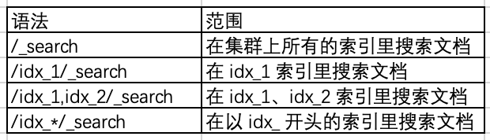
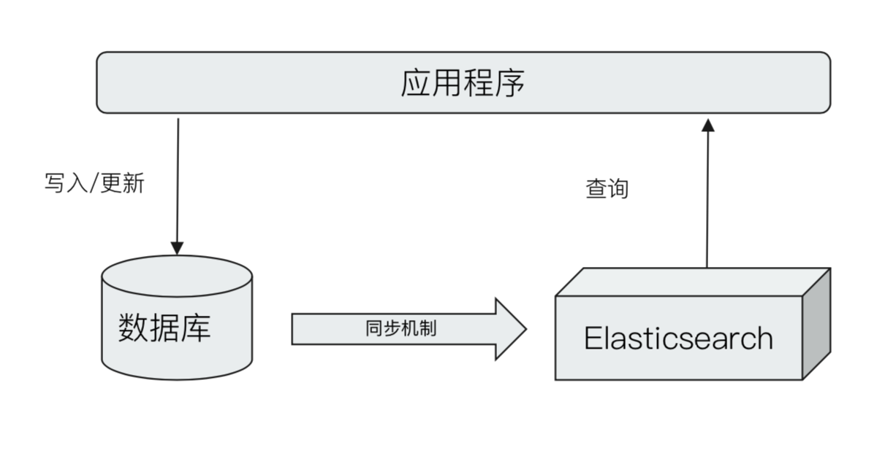

# elasticsearch-client-java

## 一、简介
    通过 Feign 把 Elasticsearch（7.1） 的 Restful API 包装成 SDK ，方便 Java 项目快速实现分词搜索业务。
    
## 二、Elasticsearch 基本概念

### 2.1 索引 Index
    Elasticsearch 的 index 是文档的容器，是一类文档的集合，可类比 MySQL 里面的表。

### 2.2 文档 Document        
    Elasticsearch 是面向文档的，文档是所有可搜索数据的最小单位，可类比 MySQL 表中的记录。

### 2.3 字段 Filed
    Elasticsearch 的文档主要是 JSON，Field 是 JSON 的字段，可类比 MySQL 表中的列。

### 2.4 指定索引 （类比 MySQL 确定数据表 `from table_xxx`）
   
       
### 2.5 Elasticsearch 与现有系统整合方案
   
      

               
